<p align="center">
  
</p>

# 16 Legs

A legacy web-project archive containing separate folders for the **frontend, API, database/data work, images, and demo material**.

## Repository structure

```text
16_legs/
├── Html/
├── css/
├── js/
├── api/
├── Database/
├── Image/
└── Demo/
```

## Why this repository matters

This project is kept as part of my development history. It represents an earlier stage where I was learning to split a web application into presentation, scripting, API, and data concerns rather than keeping everything in one file.

## Status

**Legacy project archive.** I keep it for reference rather than presenting it as a current production application.

---

**Sanam Rai** · [GitHub profile](https://github.com/SanamRai001)
